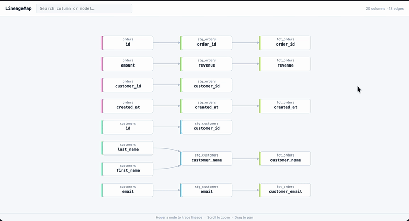

# LineageMap

Column-level data lineage for dbt projects. One command, no catalog required.



```
$ lineagemap trace --column revenue

revenue (fct_orders)
└── revenue (stg_orders)
    └── amount (raw.orders)
```

## Install

```bash
pip install lineagemap
```

For the web UI:

```bash
pip install "lineagemap[server]"
```

## Usage

Run `dbt compile` first, then:

```bash
# Interactive web UI at http://localhost:3000
lineagemap serve

# Trace a column in the terminal
lineagemap trace --column revenue

# Scope to a specific model
lineagemap trace --column revenue --model fct_orders

# Export full lineage graph as JSON
lineagemap trace --column revenue --json

# Custom manifest path or SQL dialect
lineagemap trace --column revenue --manifest path/to/manifest.json --dialect snowflake
```

### Web UI

Hover any node to see its full upstream (blue) and downstream (red) lineage instantly. Use the search bar to filter by column or model name.

## How it works

1. Reads `manifest.json` from `dbt compile` — no live warehouse connection needed
2. Parses each model's compiled SQL with [sqlglot](https://github.com/tobymao/sqlglot) to extract column-level dependencies
3. Builds a column lineage graph you can explore in the terminal or web UI

## Why LineageMap

|                         | LineageMap | dbt Cloud | DataHub      | Atlan       |
|-------------------------|:----------:|:---------:|:------------:|:-----------:|
| Column-level lineage    | ✅          | ❌         | ✅            | ✅           |
| Self-hostable           | ✅          | ❌         | ✅ (complex)  | ❌           |
| One-command setup       | ✅          | —         | ❌            | ❌           |
| No warehouse connection | ✅          | ✅         | ❌            | ❌           |
| Open source             | ✅          | ❌         | ✅            | ❌           |
| Cost                    | Free       | $$$       | Free (DIY)   | $$$$$       |

DataHub and OpenMetadata are powerful — but they require Kubernetes, Kafka, and a dedicated data platform team to operate. LineageMap is for the team that just needs to answer "what breaks if I change this column?" in under a minute.

## Roadmap

- [x] Phase 1 — CLI + SQL parser (`lineagemap trace`)
- [x] Phase 2 — Local web UI with interactive DAG visualization
- [ ] Phase 3 — Hosted tier: upload `manifest.json` → get a shareable URL
- [ ] Phase 4 — GitHub Action: post updated lineage URL on every dbt PR

## Contributing

See [CONTRIBUTING.md](CONTRIBUTING.md). Good first issues are tagged in the tracker.

## License

[Business Source License 1.1](LICENSE). Converts to Apache 2.0 on 2030-06-26. Free for personal, internal, and non-competing production use.
